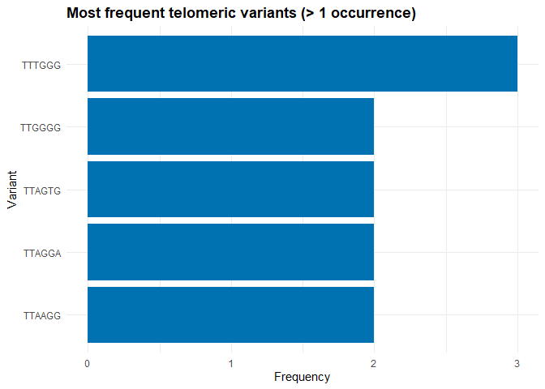
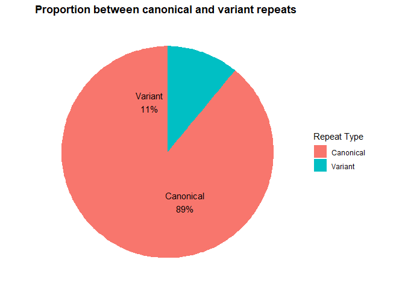

<!-- README.md is generated from README.Rmd. Please edit that file -->

# TVSrecovery

<!-- badges: start -->
<!-- badges: end -->

O pacote **TVSrecovery** foi desenvolvido para identificar, extrair e
visualizar **TVSs (Telomeric Variant Sequences)** em reads ou sequências
genômicas. Ele combina funções para:

- Buscar repetições teloméricas canônicas e variantes em arquivos FASTA.
- Identificar TVSs entre repetições canônicas consecutivas.
- Processar fita direta e complementar automaticamente.
- Gerar gráficos de barras das variantes mais frequentes.
- Gerar gráfico de pizza mostrando a proporção entre repetições
  canônicas e variantes.

O pacote facilita fluxos de trabalho envolvendo análise de telômeros e
suas variações, especialmente em organismos que apresentam TVSs
relevantes biologicamente.

## Installation

Você pode instalar a versão de desenvolvimento diretamente do GitHub
usando:

``` r
# install.packages("devtools")
devtools::install_github("ArthurOliveirapassos/TVSrecovery")
```

## Funções Principais

### `Telomeresfinder()`

Identifica sequências que contêm **N repetições canônicas consecutivas**
(incluindo reverso, complementar e reverso-complementar) em arquivos
FASTA.

### `detect_TVS()`

Extrai repetições teloméricas canônicas e identifica variantes entre
repetições consecutivas.

### `plot_TVS()`

Gera dois gráficos: - **Barras**: variantes frequentes. - **Pizza**:
proporção entre repetições canônicas e variantes.

## Exemplo de Uso

``` r
devtools::load_all()
#> ℹ Loading TVSrecovery
library(TVSrecovery)

# 1. Encontrar sequências com repetições canônicas
Telomeresfinder(
  fasta_file = "inst/extdata/example.fasta",
  telomere_repeat = "TTAGGG",
  min_repeats = 3,
  output_fasta = "inst/extdata/telomere_hits.fasta"
)
#> 32 sequences containing at least one block with 3 consecutive repeats of 'TTAGGG' (or reverse/complement) were saved to: inst/extdata/telomere_hits.fasta
#> DNAStringSet object of length 32:
#>      width seq                                              names               
#>  [1]   123 CCGTGGCACTTTAGGTTCTAGAG...CACGTGAGTCAACGACCATTTC seq_2
#>  [2]   109 ATCAAAGGCATCTGCGCGAAAAG...ACAACGAGTACATCCCGAATAA seq_3
#>  [3]   160 TGAAACCGCGAATAAATGATAGG...GGACTACCTCTCATCTATCATT seq_4
#>  [4]   148 GCTGTCTTCACGTAATGTCAATG...AGGTCCTGCGGCGGAGACTTAG seq_6
#>  [5]   135 GCACTGCGTGACCCTTCTCAAGT...CTCTGATAATAGTCAAGGAATC seq_7
#>  ...   ... ...
#> [28]   104 GTCAGTGTTGGGTCAAGCTCCCT...CTTGCCACCCACCCGAGAAAGT seq_48
#> [29]   131 GCTGCAAGGAACGGTTACCACAT...GCTAGGTAATCACCTATAATTT seq_49
#> [30]   133 GTGCACAGCGGCCAGGTCCTACG...TTCGTGATGGACGGGGATGGCT seq_50
#> [31]   128 TCACGATGATTTCGGTGTATGAG...GAAATCTACTCTTGAAGGGTCC seq_51
#> [32]   108 AATCTCCATTCCCCTACTATTCC...GCCCCTTCGAATACGCAACAGT seq_54

# 2. Detectar TVSs
resultado <- detect_TVS(
  fasta_file = "inst/extdata/telomere_hits.fasta",
  canonical_repeat = "TTAGGG"
)

# 3. Plotar resultados
graficos <- plot_TVS(resultado)
graficos$bar_plot
```



``` r
graficos$pie_plot
```


